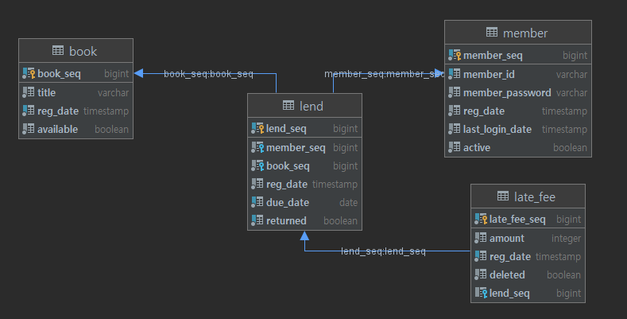

simple-spring-batch 
=============
------------

## Batch?

-----
* 데이터를 실시간으로 처리하는 것이 아닌 일괄적으로 처리하는 작업을 의미
* 한번에 대량의 데이터를 처리
* 해당 프로젝트는 책 대여점에서 아래와 같은 기능을 수행
    1.  1년간 로그인 하지않은 회원 휴면처리   
    2. 반납 일자를 넘긴 회원 연체 리스트 추가
    3. 일당 500원 연체료 추가

## dependency

-----
* gradle

      implementation 'org.springframework.boot:spring-boot-starter-batch'

 

##DB 설정

-----

##추가 목록(예정)

-----
1. Jenkins 연결하여 일일 배치가 가능하도록 설정
2. 기능 보완

##참고

-----

* https://jojoldu.tistory.com/325
* https://www.baeldung.com/spring-boot-spring-batch